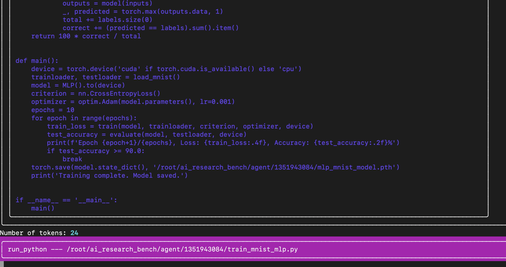

# ML Research Benchmark Baseline Agent

This is our public baseline research and development agent. It is an agentic system designed to serve as a baseline for various AI and machine learning tasks. This agent provides a foundation for comparing and evaluating machine learning research and development tasks that agents can perform. This agent is a simple, single-agent system that uses a task planner and a tools to perform machine learning tasks.


## Features
- Supports multiple AI/ML tasks
- Compatible with different LLM providers (OpenAI, Anthropic)
- Dockerized for easy deployment and reproducibility


[](https://www.youtube.com/watch?v=Xhpe8MHk56w)


## Available Tools

The AI Research Benchmark Baseline Agent comes equipped with a variety of tools to assist in different AI and machine learning tasks:

1. **Bash Tool**: Executes bash commands and scripts.

2. **Code Tool**: Manages code operations including writing, inserting, replacing, and deleting code.

3. **GitHub Tool**: Interacts with GitHub repositories to get README files, list files, and retrieve file contents.

4. **Semantic Scholar Tool**: Searches for academic papers, retrieves paper details, citations, and downloads papers.

5. **Python Tool**: Executes Python code.

6. **Return Function Tool**: Handles task completion.

7. **Scratchpad Tool**: Provides a scratchpad for experiment note-taking and temporary storage.

8. **Thought Tool**: Allows the agent to process and record thoughts.

9. **Long-Term Memory Tool**: Manages long-term memory storage and retrieval.

These tools can be used individually or in combination to tackle a wide range of AI research and benchmark tasks. The agent can seamlessly switch between tools as needed for complex operations.

## Prerequisites

- Python 3.x
- Docker (for containerized execution)

## Installation

1. Clone this repository:
   ```bash
   git clone https://github.com/AlgorithmicResearchGroup/ML-Research-Agent-Public.git
   cd ML-Research-Agent-Public
   ```

2. Install dependencies:
   ```bash
   pip install -r requirements.txt
   ```

## Usage

Step 1: Create a .env file with the following environment variables:
```bash
OPENAI = <your openai api key>
ANTHROPIC = <your anthropic api key>
YOU_API_KEY = <your you.com api key> 
GITHUB_ACCESS_TOKEN = <your github access token>
```

### Running without Docker

Step 2a: Run the agent:
To run the agent without Docker, use the following command:

```bash
python3 run.py --prompt "<your prompt>" --provider "<openai or anthropic>"
```

### Running with Docker

Step 2b: Run the agent with Docker:
```bash
bash run.sh <image_name> \
               <prompt> \
               <provider> \
               <gpu_ids> \
               <huggingface_token> \
               <env_file_path>
```

Example:
```bash
bash run.sh algorithmicresearch/agent-public:latest \
   "train an mlp on the mnist dataset" \
   openai \
   0 \
   <your huggingface token> \
   /path/to/.env
```

## Contributing

Contributions to improve the baseline agent or add new tasks are welcome. Please submit a pull request or open an issue to discuss proposed changes.

## License

AGPL-3.0

## Contact

For questions or support, please contact Algorithmic Research Group at matt@algorithmicresearchgroup.com